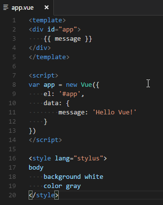
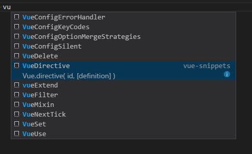

# Vue 2 Snippets for Visual Studio code

This extension adds Vue 2 Code Snippets and Syntax Highlight into Visual Studio Code.

这个插件基于最新的 [Vue 官方语法高亮文件](https://github.com/vuejs/vue-syntax-highlight/blob/master/vue.tmLanguage)添加了Syntax Highlight，并且依据 Vue 2 的 API 添加了Code Snippets。

[](https://marketplace.visualstudio.com/items?itemName=hollowtree.vue-snippets)
[](https://marketplace.visualstudio.com/items?itemName=hollowtree.vue-snippets)

### important!!
If you have add .vue file extension to the vue identifier in configure settings, please **remove** it. In version 1.8.0, VS Code have improve JavaScript/CSS language support in HTML ([Reference](https://code.visualstudio.com/updates#_javascript-language-support-in-html)). So these settings are no longer useful. And if you don't remove these settings, JavaScript and CSS intelliSense can't work in the `.vue` file.

如果你在设置中添加了如下设置，请移除这些设置，在1.8.0版本中，VS Code 增强了对 HTML 的内嵌语言（JS、CSS）的支持。因此这些设置现在是无用的了，而且如果不移除这些设置的话，JS 和 CSS 的智能提示无法在`.vue`文件中起作用。
```
// if your VS code's version number is greater than 1.8.0, please remove these settings.
"files.associations": {
        "*.vue": "vue"
    }
```

### It looks like:





### Snippets
Including most of the API of Vue.js 2. You can type `vcom`, choose `VueConfigOptionMergeStrategies`, and press ENTER, then `Vue.config.optionMergeStrategies` appear on the screen.

插件的 Snippets 如下表格所示，比如你可以键入 `vcom` 然后按上下键选中 `VueConfigOptionMergeStrategies` 再按Enter键，就输入了`Vue.config.optionMergeStrategies`了。

| Prefix | JavaScript Snippet Content |
| ------ | ------------ |
| `import` | `import ... from ...` |
| `newVue` | `new Vue({...})` |
| `VueConfigSilent` | `Vue.config.silent = true` |
| `VueConfigOptionMergeStrategies` | `Vue.config.optionMergeStrategies` |
| `VueConfigDevtools` | `Vue.config.devtools = true` |
| `VueConfigErrorHandler` | `Vue.config.errorHandler = function (err, vm) {...}` |
| `VueConfigIgnoredElements` | `Vue.config.ignoredElements = ['']` \
| `VueConfigKeyCodes` | `Vue.config.keyCodes` |
| `vueExtend` | `Vue.extend( options )` |
| `VueNextTick` | `Vue.nextTick( callback, [context] )` |
| `VueSet` | `Vue.set( object, key, value )` |
| `VueDelete` | `Vue.delete( object, key )` |
| `VueDirective` | `Vue.directive( id, [definition] )` |
| `VueFilter` | `Vue.filter( id, [definition] )` |
| `VueComponent` | `Vue.component( id, [definition] )` |
| `VueUse` | `Vue.use( plugin )` |
| `VueMixin` | `Vue.mixin( mixin )` |
| `VueCompile` | `Vue.compile( template )` |
| `vmData` | `vm.$data` |
| `vmEl` | `vm.$el` |
| `vmOptions` | `vm.$options` |
| `vmParent` | `vm.$parent` |
| `vmRoot` | `vm.$root` |
| `vmChildren` | `vm.$children` |
| `vmSlots` | `vm.$slots` |
| `vmScopedSlots` | `this.$scopedSlots.default({})` |
| `vmRefs` | `vm.$refs` |
| `vmIsServer` | `vm.$isServer` |
| `vmWatch` | `vm.$watch( expOrFn, callback, [options] )` |
| `vmSet` | `vm.$set( object, key, value )` |
| `vmDelete` | `vm.$delete( object, key )` |
| `vmOn` | `vm.$on( event, callback )` |
| `vmOnce` | `vm.$once( event, callback )` |
| `vmOff` | `vm.$off( [event, callback] )` |
| `vmEmit` | `vm.$emit( event, […args] )` |
| `vmMount` | `vm.$mount( [elementOrSelector] )` |
| `vmForceUpdate` | `vm.$forceUpdate()` |
| `vmNextTick` | `vm.$nextTick( callback )` |
| `vmDestroy` | `vm.$destroy()` |
| `renderer` | `const renderer = require('vue-server-renderer').createRenderer()` |
| `createRenderer` | `createRenderer({ })` |
| `preventDefault` | `preventDefault();` |
| `stopPropagation` | `stopPropagation();` |


| Prefix | HTML Snippet Content |
| ------ | ------------ |
| `template` | `<template></template>` |
| `script` | `<script></script>` |
| `style` | `<style></style>` |
| `vText` | `v-text=msg` |
| `vHtml` | `v-html=html` |
| `vIf` | `v-if` |
| `vShow` | `v-show` |
| `vElse` | `v-else` |
| `vElseIf` | `v-else-if` |
| `vFor` | `v-for` |
| `vOn` | `v-on` |
| `vBind` | `v-bind` |
| `vModel` | `v-model` |
| `vPre` | `v-pre` |
| `vCloak` | `v-cloak` |
| `vOnce` | `v-once` |
| `key` | `:key` |
| `ref` | `ref`|
| `slotA` | `slot=""`|
| `slotE` | `<slot></slot>`|
| `component` | `<component :is=''></component>`|
| `keepAlive` | `<keep-alive></keep-alive>` |
| `transition` | `<transition></transition>` |
| `transitionGroup` | `<transition-group></transition-group>` |


| Prefix | Vue Router Snippet Content |
| ------ | ------------ |
| `routerLink` | `<router-link></router-link>` |
| `routerView` | `<router-view></router-view>` |
| `to` | `to=""` |
| `tag` | `tag=""` |
| `newVueRouter` | `const router = newVueRouter({ })` |
| `routerBeforeEach` | `router.beforeEach((to, from, next) => { }` |
| `routerReplace` | `router.replace()` |
| `routerGo` | `router.go()` |
| `routerPush` | `router.push()` |
| `routes` | `routes: []` |
| `beforeEnter` | `beforeEnter: (to, from, next) => { }` |
| `beforeRouteEnter` | `beforeRouteEnter: (to, from, next) => { }` |
| `beforeRouteLeave` | `beforeRouteLeave: (to, from, next) => { }` |
| `scrollBehavior` | `scrollBehavior (to, from, savedPosition) { }` |


| Prefix | Vuex Snippet Content |
| ------ | ------------ |
| `newVuexStore` | `const store = new Vuex.Store({ })` |

### Supported languages
* vue(.vue)
* HTML(.html)

* javascript(.js)
* typescript(.ts)

### Base on
[vue-syntax-highlight (vue.tmLanguage)](https://github.com/vuejs/vue-syntax-highlight/blob/master/vue.tmLanguage)


--------------------------------------
##### 2017/01/01 (0.1.0)
* Update some sinppets

##### 2016/12/31 (0.0.10)
* Update newest api sinppets (like `v-else-if` / `Vue.config.ignoredElements` and so on)
* fix a bug (before: `vm.off`,after:`vm.$off`)

##### 2016/12/15 (0.0.9)
* Update newest syntax highlight file

##### 2016/11/13 (0.0.8)
* Add some snippets
* Change this extension's logo to vue's logo
* Update readme

##### 2016/10/18 (0.0.7)
* Fix `v-for` snippet

##### 2016/10/18 (0.0.6)
* Publish failed

##### 2016/10/16 (0.0.5)
* Fix this extension can not be downloaded with the latest version(1.6.1) of VS code

##### 2016/10/15 (0.0.4)
* Update readme

##### 2016/09/30 (0.0.1)
* Add code snippets
* Add syntax highlight