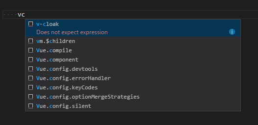

# Canvas Snippets for Visual Studio code

It looks like:


The menu under **File > Preferences (Code > Preferences on Mac)** provides entries to configure settings([Reference](https://code.visualstudio.com/docs/languages/overview#_adding-a-file-extension-to-a-language)). Please add the .vue file extension to the vue identifier like this:
```
"files.associations": {
        "*.vue": "vue"
    }
```


